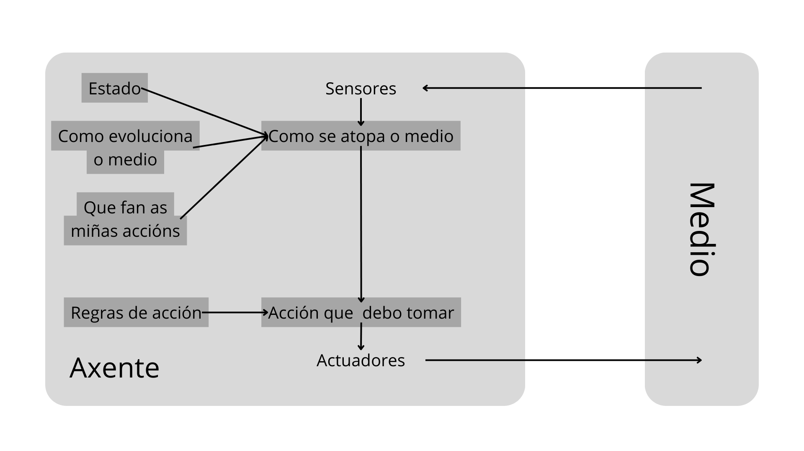

# QeQ (¿Quién es quién?)

Este proyecto está pensado para la asignatura de MIA del CE en IA y Big Data del IES de Teis. Consiste en la implementación de un modelo que sea capaz de resolver una partida del juego de mesa clásico *¿Quién es Quién?* utilizando Python y una base de datos hecha en Prolog.

## Optimización vs Búsquedas

El juego de *¿Quién es quién?* se considera más un problema de optimización porque el objetivo es minimizar el número de recursos utilizados (en este caso el número de preguntas), no sólo encontrar la solución final (el personaje).

## Entorno

| Entorno |  Observable  |   Agentes   | Determinista | Episódico | Estático | Discreto | Conocido |
| :------: | :----------: | :---------: | :----------: | :--------: | :-------: | :------: | :------: |
| GuessWho | Parcialmente | Multiagente | Estocástico | Secuencial | Estático | Discreto | Conocido |

## Algoritmo

El algoritmo cuenta cuantas personas tienen cada característica, calcula la media y escoge la característica que tenga un recuento más cercano a la media. Esta característica será por la que pregunte. Aunque no es la forma más correcta (ya que si existe una desviación bastante alta no encontraremos la mitad con este método), este algoritmo intenta descartar la mitad de las posibles respuestas en cada episodio.

## Estructura del Agente



## Programación lógica

La programación lógica se aplica bastante bien a este juego porque está pensada para representar atributos y características de forma sencilla gracias a su formato declarativo.

## Base de datos Prolog

He utilizado una BD de Prolog para representar a cada personaje. Cada uno de estos personajes está representado por un enunciado que contiene el nombre del personaje y una lista con las características que lo representan.

## Los personajes


## Uso y ejecución

Crea un entorno conda con las mismas especificaciones (es necesario tener una instalación compatible de SWI Prolog):

```bash
conda env create -f environment.yml
```

Ejecuta el programa:

```shell
python qeq.py
```
